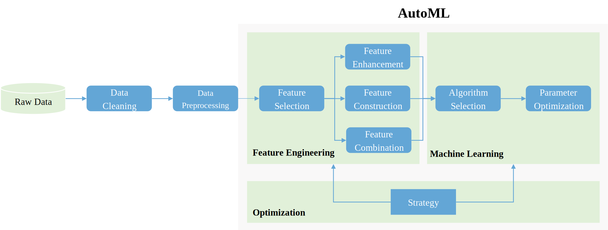
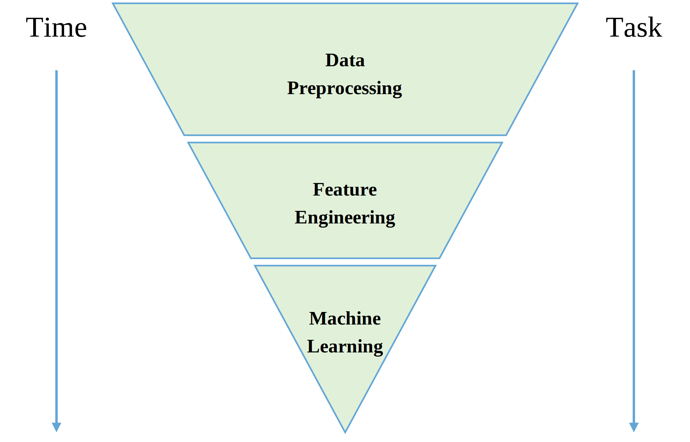

# Automated Pipeline: AutoML

:::{note}
`AutoML` is an idea at present.
:::

`AutoML` (*Automated Machine Learning*) tries to let automatically finish the following tasks:

- `Data Cleaning`
- `Data Preprocessing`
- `Feature Engineering`
- `Algorithm Selection`
- `Hyperparameter Optimization`

## What Could AutoML Do Now?

{math}`AutoML \xleftarrow{OptimizationAlgorithm} Feature Engineering Pipeline + ML Pipeline`

It tries to use `Optimization` algorithms to optimize the selection of `ML` and the parameters of `ML`.

- Part of `Feature Engneering`
- `Algorithm Selection`
- `Hyperparameter Optimization`

`Hyperparameter Optimization` already has the iterable method such as the `Grid Search`.

With the `Intelligent Optimization Algorithm` helping, `Hyperparameter Optimization` could be much easier done.
And the same time, `Algorithm Selection` could be done at the same time. The `Intelligent Optimization Algorithm` searching effectction power is much more than iterable method.

The {class}`~dtoolkit.transformer.Transformer` and {class}`~sklearn.pipeline.Pipeline` could be the bridge for `Intelligent Optimization Algorithm` from abstract theory to specific application.

To build the bridge for `GA` (*Genetic Algorithm*), {class}`dtoolkit.transformer.Transformer` and the `Hyperparameter` could be the gene. And {class}`sklearn.pipeline.Pipeline` is the chromosome.

As for `Feature Engineering`, part of them could be automated. `Feature Engineering` will face more problems when it is automated. The big problem is the sequence and the combination of `Feature Engineering` plugins in a pipeline is arbitrary.

## What Would AutoML Do via Pipeline?

The time cost of the modeling procedure is like an inverted pyramid.
`Data Preprocessing` would spend double or more times of `Feature Engineering` and `Machine Learning`.

Base the idea of {class}`~dtoolkit.transformer.Transformer` and {class}`~sklearn.pipeline.Pipeline` we could transform our data preprocessing script into a standard plugin.

So in this way, data processing could also be automated.

{math}`AutoML \xleftarrow{Optimization Algorithm} Data Preprocessing Pipeline + Feature Engineering Pipeline + ML Pipeline`

However, the same problem of automated `Feature Engineering` facing is also happened to automated `Data Preprocessing`.

In our `ML` experience, it could be fix via indirect way.
Some plugins of sequence and combination are fixed such as we would use `Order Transformer` then use `OneHotEncoder` to handle categorical variables.

In other words, there need not only `Optimization Algorithm` but also `Strategy`.

`Strategy` means plugins of sequence and combination is not **real** arbitrary, them have some invisible mode and connection.
For `GA`, just like genes don't always work up alone, they could also work up together in parts.

{math}`AutoML \xleftarrow[Strategy]{Optimization Algorithm} Data Preprocessing Pipeline + Feature Engineering Pipeline + ML Pipeline`

