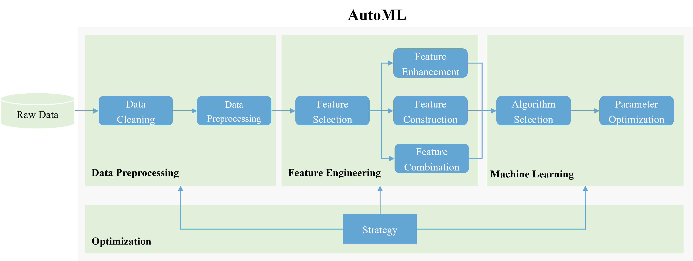
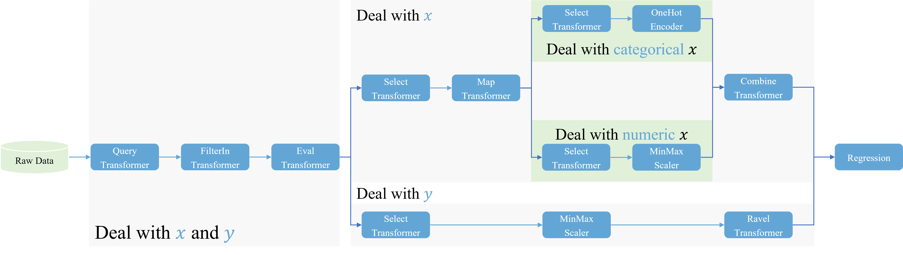

# Pipeline One More Step: AutoML

It tries to use `Optimization` algorithms to optimize the selection of `ML` and the parameters of `ML`.

`AutoML` (*Automated Machine Learning*) tries to let automatically finish the following tasks:

- `Data Cleaning`
- `Data Preprocessing`
- `Feature Engineering`
- `Algorithm Selection`
- `Hyperparameter Optimization`

## What could `AutoML` do now?

`AutoML` = `Feature Engineering Pipeline` + `ML Pipeline`

- Part of `Feature Engneering`
- `Algorithm Selection`
- `Hyperparameter Optimization`

`Hyperparameter Optimization` already has the iterable method such as the `Grid Search`.

With the `Intelligent Optimization Algorithm` helping, `Hyperparameter Optimization` could be much easier done.
And the same time, `Algorithm Selection` could be done at the same time. The `Intelligent Optimization Algorithm` power is much more than iterable method.

The {class}`dtoolkit.transformer.Transformer` and {class}`sklearn.pipeline.Pipeline` could be the bridge for these algorithms from abstract theory to specifc application.

To build the bridge for `GA` (*Genetic Algorithm*), {class}`dtoolkit.transformer.Transformer` and the `Hyperparameter` could be the genric. And {class}`sklearn.pipeline.Pipeline` is the chromosome.

As for `Feature Engineering`, part of them could be automated. `Feature Engineering` will face more problems to be automated. The big problem is the sequence and the combination of `Feature Engineering` plugins in a pipeline is arbitary.

## What would `AutoML` do via Pipeline?

Base the idea of {class}`dtoolkit.transformer.Transformer` and {class}`sklearn.pipeline.Pipeline` we could transform our data preprocessing script into a plugin.

So in this way, data processing could be automated.

`AutoML` = `Data Preprocessing Pipeline` + `Feature Engineering Pipeline` + `ML Pipeline`

However, the same problem of automated `Feature Engineering` facing is also happened to automated `Data Preprocessing`.

In my `ML` experience, it could be fix via indirect way.

## A Example of `Pipeline`

