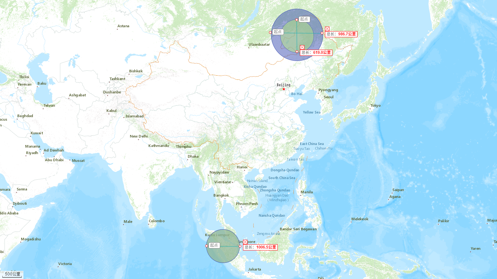

# What is the Geographic Buffer?

:::{note}
This tutorial requires basic **GIS** (Geographic Information System) knowledge.
:::

## What is the Buffer?

:::{note}
All buffer of geometries are created on **2D plane**.
:::

A simple graph could show this.

> From [ArcGIS analysis-toolbox Buffer](https://desktop.arcgis.com/en/arcmap/latest/tools/analysis-toolbox/buffer.htm)

The graph shows the buffer generation of three basic kinds of geometries.

- Point
- Line
- Polygon

And the graph also shows the way to deal with the overlapping relationship of multi-buffers.

## Latitude, Longitude and Earth

This section comes to introduce CRS (Coordinate Reference Systems).

Simply say CRS shows a mapping relationship between 3D ellipsoid Earth and 2D plane.

Some CRSs we have already met, the GPS coordniate references, used in online map:

- `EPSG:4326`: {math}`(120°, 50°)`, sphere reference
- `EPSG:3857`: {math}`(13358338.90m, 6446275.84m)`, surface reference

## Non Geographic Buffer

The method of {meth}`geopandas.GeoSeries.buffer` created buffer is not a really buffer in the map.

### Steps to Generate Buffer

Let us select two `EPSG:4326` coordinates and show their buffer on map.

- {math}`(122, 50)`
- {math}`(100, 1)`

Then let us generate {math}`500km` buffers for those two points.

With the following steps:

1. Transform points from `EPSG:4326` to `EPSG:3857`.
2. Generate {math}`500km` buffer via {meth}`~geopandas.GeoSeries.buffer`.
3. Transform points from `EPSG:3857` to `EPSG:4326`.
4. Display on the map.

The green one is the non geographic buffer, and the blue one is the geographic buffer.

As we see the green one's diameter is less than {math}`1000km`.

### Problem of Non Geographic Buffer

The following GIF could tell us why the green one is smaller than the blue one.

> From [WikiPedia Mercator Projection](https://en.wikipedia.orgwiki/Mercator_projection)

The `EPSG:3857` is a cylindrical map projection, that cause the area which closes to the equator is the same as real.

## Geographic Buffer

A idea to fix this is to use local CRS.
Local CRS means build CRS for each point.

> From [PROJ Coordinate operations](https://proj.org/operations/projections/aeqd.html)

All most single mapping relationships are good for a piece of small areas.
But what if we build a lot of mapping relationships and then combine them together, this new mapping relationship could represent all areas.

In this way, CRS could totally describe the point in Earth.

That is what the {meth}`dtoolkit.geography.geographic_buffer` method does.

What's next? Try to use it.
