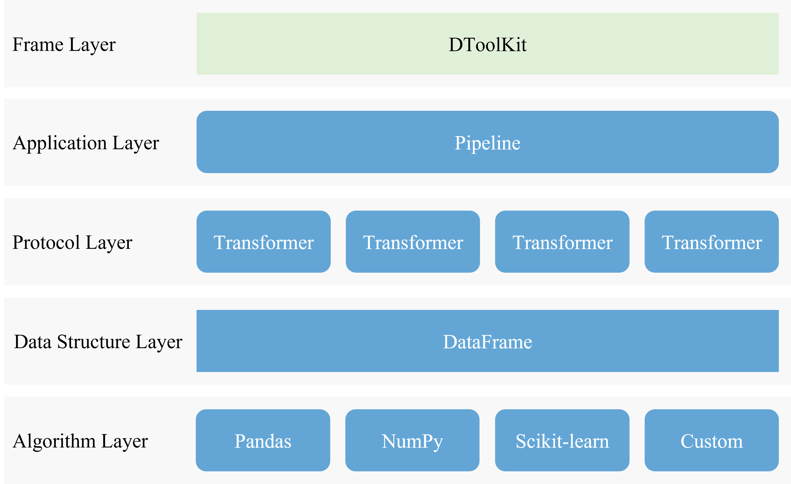
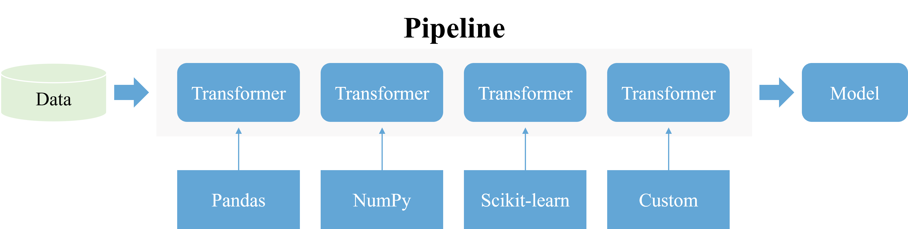

# Transformer and Pipeline Brief Description

> Image by [Robson Machado](https://pixabay.com/photos/winter-alaska-pipeline-oil-snow-681175/)

## What is Transformer?

The `Transformer` is a protocol that defines the input port and output port.

It is just like a **pipe** in the real world.

## What is Pipeline?

The `Pipeline` combines each port of `Transformer` into a stream.

You could control the **direction** of the stream to go forward or backward.
And you could stop the stream where you want and check its **internal**.

It is just like a real **pipeline** in the real world.

> From [Python Machine Learning Book Chapter 6](https://nbviewer.org/github/rasbt/python-machine-learning-book/blob/master/code/ch06/ch06.ipynb)

## What {class}`dtoolkit.transformer` does?

{class}`dtoolkit.transformer` does two things:

- Let {class}`~pandas.DataFrame` as the basic data structure of {class}`~dtoolkit.transformer.Transformer`.
- Transform all methods / algorithms into {class}`~dtoolkit.transformer.Transformer`.

### {class}`~pandas.DataFrame` in and {class}`~pandas.DataFrame` out

{class}`sklearn.base.TransformerMixin` let `array-like` in `array-like` out.

As if there has a pipline `[DropColumnTF, DropRowTF, Map, MapColumnTF]`.
If we put a {class}`~pandas.DataFrame` into this pipeline and want to debug and check the preprocessing data. However, it is hard to trace the data changing. There is only left data itself, other information is missing.

It is important to keep track of the data changing. So {class}`dtoolkit.transformer` would keep the {class}`~pandas.DataFrame` unchanged in stream, let {class}`~pandas.DataFrame` in and {class}`~pandas.DataFrame` out.

### Engineering of Data Preprocessing

What would be going on if there are a lot of transformers?

A surprise comes here.

So {class}`dtoolkit.transformer` could handle what a mess codes of data preprocessing codes.

It can face to the engineering of data preprocessing.

### The Next Step

{math}`Data Preprocessing Pipeline + Feature Engine Pipeline + ML Pipeline \to Auto ML (All\;in\;One)`

A real big surprise comes here.
