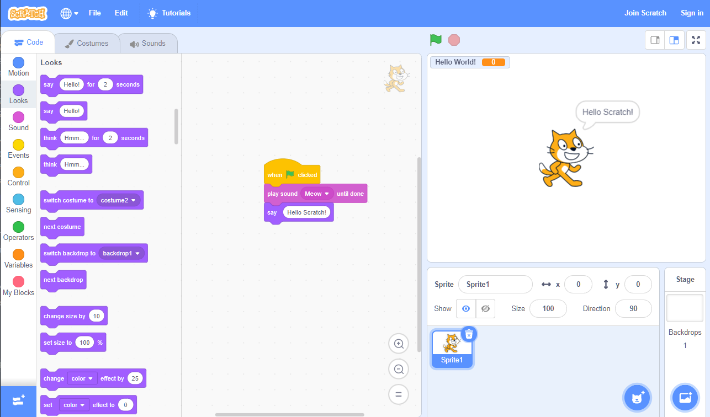
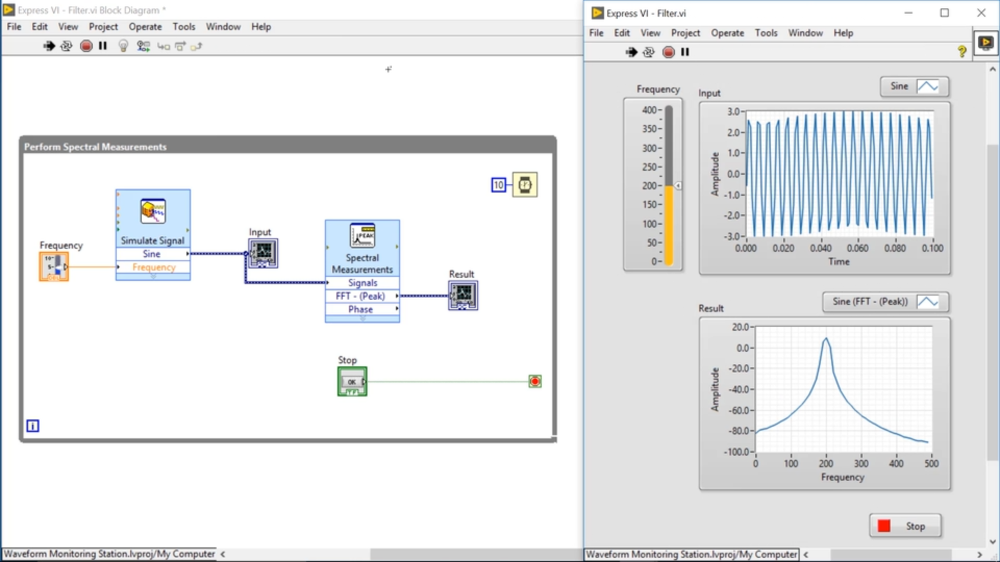

(workflow)=
# Data Visual Modeling Language: `Workflow`

:::{note}
`Workflow` is an idea at present.
:::

## What is the `Workflow`?

`Workflow` is the visual programming, it can help us change the way of work from writing code to dragging components. The following graphs show some software I have met. And each of them is facing a specific field.

- [Scratch](https://scratch.mit.edu/): programming enlightenment education
- [LabVIEW](https://www.ni.com/en-us/shop/labview.html): hardware accessing and controlling
- [ArcGIS](https://www.esri.com/en-us/arcgis/products/arcgis-pro/overview): GIS Platform
- [FME](https://www.safe.com/): spatial data processing
- [Orange](https://orangedatamining.com/): machine learning

If you know about them, you would get the programming experience is totally different.

- Fast
- Efficient
- Convenient
- Understandable

> From [Scratch editor](https://scratch.mit.edu/projects/editor)

> From [NI website: what is labview?](https://www.ni.com/en-us/shop/labview.html)

> From [ArcGIS blog](https://www.esri.com/arcgis-blog/products/announcements/announcements/arcgis-pro-2-1-has-been-released/)

> From [Safe software gitbook](https://safe-software.gitbooks.io/fme-desktop-data-integration-2018/content/Integration2Lab/2.01.FMEDesktopComponents.html)

> From [Orange website screenshots](https://orangedatamining.com/screenshots/)

## Question & Answer

### How Do `Pipeline` with `Workflow`?

The `Pipeline` could be the engine of `Workflow`, and `Workflow` is the `UI` of `Pipeline`.

### How Do `Workflow` with `AutoML`?

`Workflow` is the human intelligence, `AutoML` is the machine intelligence.

So `Workflow` + `AutoML` could combine intelligence of both human and machine.

### What is Different from Similar Software?

The core of `Data Mining` work is `Data Analysis`.
But the most costing time is `Data Preprocessing` the steps before `Data Analysis`.

There are a lot of `Data Analysis` tools could do `Data Visualization`, `Data Analysis` and `Machine Learning` such as:

- [Excel](https://www.microsoft.com/en-us/microsoft-365/excel)
- [Power BI](https://powerbi.microsoft.com/)
- [Tableau](https://www.tableau.com/)
- [Weka](https://www.cs.waikato.ac.nz/ml/weka/)
- [Matlab](https://www.mathworks.com/)
- ...

But `Data Preprocessing` still needs to write code.

## A Example of `Workflow`

This is a store data complete pipeline what we have seen at {ref}`Transformer and Pipeline Quickstart <further-more-steps-to-pipeline>`.

All jobs in `Pipeline`, from `Data Cleaning` to `Data Preprocessing`, from `Feature Engineering` to `Regression`.

With the helping of `Pipeline`, the total work could easily be drawn into workflow.

This workflow is clearly described.
